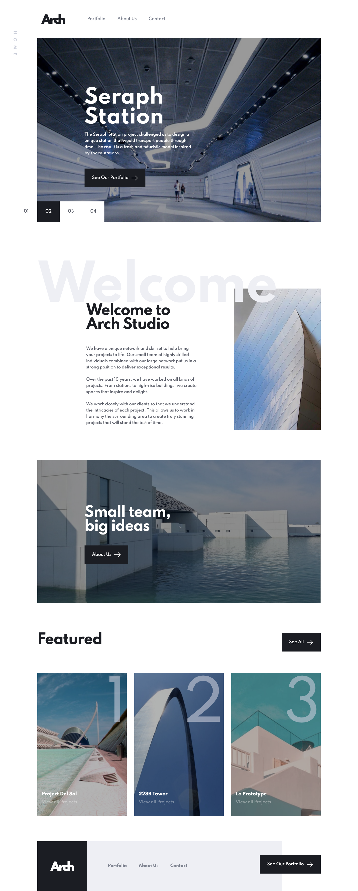

# Arch Studio multi-page website

### The challenge

Users able to:

- View the optimal layout for each page depending on their device's screen size
- See hover states for all interactive elements throughout the site
- Receive an error message when the contact form is submitted if:

  - The `Name`, `Email` or `Message` fields are empty should show "Can't be empty"
  - The `Email` is not formatted correctly should show "Please use a valid email address"

- [Live perview](https://archapp.netlify.app/)

### Screenshot

## My process

### Built with

- [React](https://reactjs.org/) - JS library
- [ReactBootstrap](https://react-bootstrap.github.io/) - For styles
